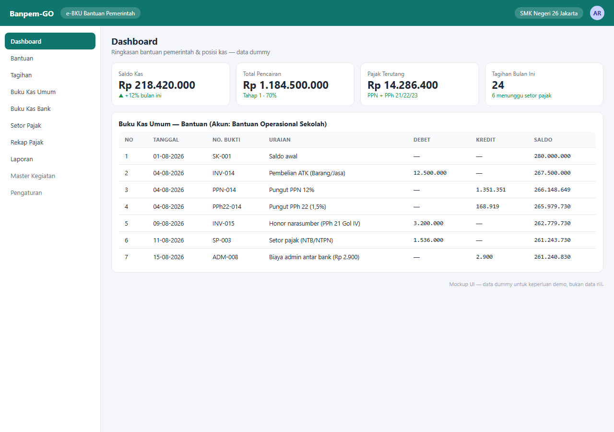

# Banpem-GO — Government Grant Cash Book (e-BKU)

[](https://github.com/adityarahmanananda-dev/banpem-go/actions/workflows/ci.yml)

A Go web app for administering **government grant cash books (e-BKU)** at schools (in use at SMK Negeri 26 Jakarta). It manages every grant account: opening balance, phased disbursement, invoices, and official financial reports — using **integer-based money arithmetic (cents) + banker's rounding (ROUND HALF-EVEN)** at every step (the specification forbids floats).

## Screenshot



> Screenshot is a UI mockup with dummy data — not real data.

## Features

- **Grant management** — CRUD per grant, automatic phase-1 disbursement (70% of the amount when > Rp100,000,000), opening balance.
- **Tax engine** (`internal/tax`) — VAT 12%, PPh 22 (1.5%), PPh 23 (2%), PPh 21 (5/15/2.5% by speaker class), 5 invoice menu types (Goods/Services, Speaker Honorarium, Participant Honorarium, Transport, Per-diem). Ships with 5 mandatory test vectors in `tax_test.go`.
- **Two ledgers** — *General Cash Book (BKU)* and *Bank Cash Book* with automatic entries per invoice (payment, VAT/income-tax withholding, Rp2,900 admin fee for interbank transfers), running balance, and a "Real vs 100% Plan" offset view.
- **Tax deposit workflow** — multi-invoice tax deposits with NTB/NTPN references, plus **bank interest** entries.
- **Hierarchical master data** — Activity → Sub-activity → Activity → Component (with per-component budget ceiling), cascading dropdowns for invoice realization rows and proportional tax allocation.
- **Reports & export** — Excel (`.xlsx`), PDF, and Word (`.docx`) for **BKU, Bank Cash Book, Tax Recap, Spending Recap, Invoice List, RAB, Realization Recap, Fund Usage Recap** — all with Indonesian signature blocks, A4 layout, repeating table headers, and specific Excel styling (header `#4472C4`, totals `#D9E2F3`).
- **Row reordering** of ledger/spending via drag-and-drop (SortableJS).
- **Database backup** — SQL-dump snapshot at every startup (keeps the last 10), plus export/import via UI with structure validation.

## Tech stack

- **Go 1.24** — stdlib `net/http` + `html/template` with `embed.FS` for templates/static.
- **PostgreSQL** — `jackc/pgx/v5` (pgxpool).
- **Export** — `go-pdf/fpdf` (PDF), `xuri/excelize/v2` (XLSX), and a custom `.docx` writer (zip/XML); Arimo font embedded.
- **Frontend** — Bootstrap 5.3 + Bootstrap Icons + SortableJS (CDN), `app.js`/`app.css` embedded into the binary.
- **Docker** — multi-stage Dockerfile (`golang:1.24-alpine` → `alpine:3.20`, non-root, static binary) + `docker-compose.yml`.

## Installation & running

### Docker

```bash
docker compose up --build     # app on :8080
```

### Local

```bash
cd backend
go run ./cmd/server           # requires DATABASE_URL
```

SQL migrations run automatically at startup.

## Configuration (env)

| Variable | Default | Description |
|---|---|---|
| `DATABASE_URL` | — | PostgreSQL DSN (required) |
| `BACKUP_DIR` | `/backups` | Backup snapshot directory |
| `ADDR` | `:8080` | Server listen address |

Copy `.env.example` to `.env` for local config. **Never commit `.env`** (git-ignored).

## Project structure

```
backend/
├── cmd/server/main.go        # entry point: env, DB, migrate, backup, serve
├── Dockerfile, go.mod, go.sum
├── internal/
│   ├── server/               # HTTP layer + 24 HTML templates
│   ├── store/                # data layer (models, ledger, dump, app_*)
│   ├── tax/                  # tax engine (+tax_test.go)
│   ├── money/                # cent arithmetic, HALF-EVEN (+money_test.go)
│   ├── export/               # report model + excel.go, pdf.go, word.go, fonts
│   └── migrations/           # 001_init.sql … 004_aktivitas.sql
└── migrations/001_init.sql   # legacy schema copy
```

## Notes

- The full behavior specification is in `PROMPT_eBKU_STACK_AGNOSTIC.txt` (828 lines, Indonesian).
- `docker-compose.yml` only defines the `app` service and depends on an external Postgres (e.g. Supabase pooler); there is no built-in `db` service.